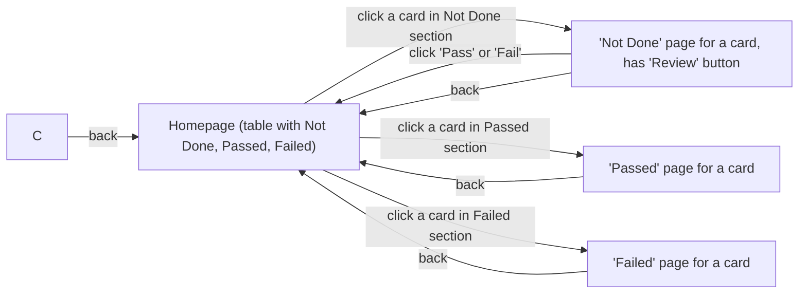
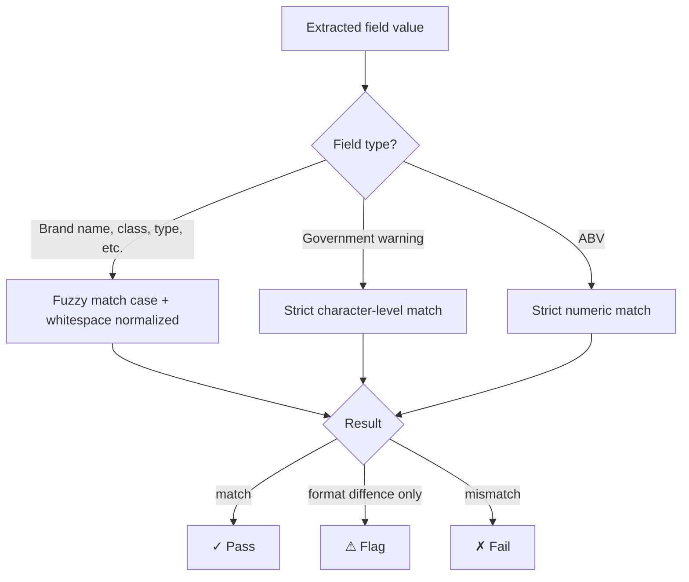

### Flow Diagrams

**Page map:**

```mermaid
flowchart LR
    A["Homepage (table with Not Done, Passed, Failed)"] -- "click a card in Not Done section" --> B["'Not Done' page for a card, has 'Review' button"]
    A -- "click a card in Passed section" --> D["'Passed' page for a card"]
    A -- "click a card in Failed section" --> E["'Failed' page for a card"]
    B -- "click 'Pass' or 'Fail'" --> A
    C -- "back" --> A
    B -- "back" --> A
    D -- "back" --> A
    E -- "back" --> A
```

**Per-field comparison logic:**

```mermaid
flowchart TD
    A[Extracted field value] --> B{Field type?}
    B -- "Brand name, class, type, etc." --> C[Fuzzy match case + whitespace normalized]
    B -- "Government warning" --> D[Strict character-level match]
    B -- "ABV" --> E[Strict numeric match]
    C --> F{Result}
    D --> F
    E --> F
    F -- "match" --> G[✓ Pass]
    F -- "format diffence only" --> H[⚠ Flag]
    F -- "mismatch" --> I[✗ Fail]
```